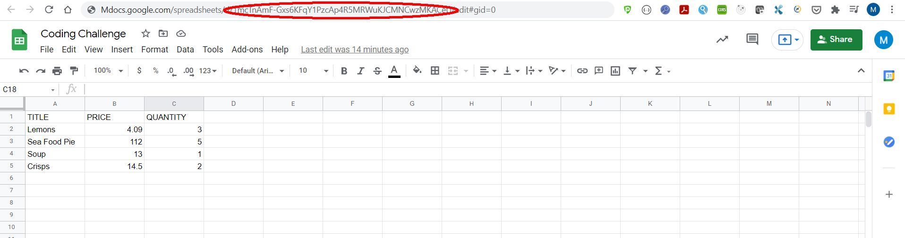

# Coding Challenge

ExpressJS/SQL Database Coding Challenge

Instructions for how to install and run the code (windows):

1. To view the github repo go to:

`https://github.com/euroledger/challenge`

2. clone the code

`git clone -b test https://github.com/euroledger/challenge.git`

`cd challenge`

3. Install server node modules

`npm install`

# Setting up the (MySQL) Database

4. Install MySQL

`https://dev.mysql.com/downloads/installer/`

5. Execute the schema script in 

`sql/create_schema.sql`

This will create the database (testdb) and the four tables we use in this exercise, along with indexes, primary/foreign keys etc.
It should also load 100 rows of dummy (test) data into the users table and the products table.

Dummy data generated with http://www.mockaroo.com

If there are any connection errors like this one:

`ER_NOT_SUPPORTED_AUTH_MODE: Client does not support authentication protocol requested by server`

Run the script set_root.sql which should fix this

You will need to create a .env file in the root folder containing the following environment variables:

    MYSQL_USER='<YOUR DB USER>'
    MYSQL_PASSWORD='<YOUR DB PASSWORD>'
    MYSQL_HOST='localhost'
    MYSQL_PORT='3306'
    MYSQL_DATABASE='testdb'`

6. To run the server, execute in the root folder as follows:

`npm run dev`

This runs the server using nodemon

To interact with the server, use this URL in the browser:

1. Index Route
`localhost:3000`

2. To list all products, use this REST API endpoint, type in browser:

`localhost:3000/products`

For most of the API routes it is best to use a http request tool such as Postman

The routes are

3. Add a new product

`localhost:3000/addproduct`

with json payload of

`{   
    "name": "Seafood Pie",
    "merchant_id": "2237544793",
    "price": "67.44",
    "status": "IN STOCK",
    "created_at": "2021-08-18 00:00:00"
}`

4. Create a new order 

`localhost:3000/createorder`

with a payload of 

`{
    "user_id": 52, 
    "status": "PENDING",
    "created_at": "2021-08-18 00:00:00",
    "items": [
        {
            "product_id": "88",
            "quantity": "2"
        },
        {
            "product_id": "56",
            "quantity": "1"
        }
    ]
}`

Here we are inserting a new order, and for each item in the order we add a new row to the order_items table

5. Search for products for a given order id

`localhost:3000/productsbyid`

payload is:

`{
    "id": "21"
}`

6. Add a product to an order

`localhost:3000/createorder/new`

payload:

`{
    "order_id": 21,
    "product_id": 2,
    "quantity": 1
}`

# Unit Tests

There are some unit tests for the routing; these can be found in `app.test.js`
The tests use supertest and jest to run the test suite, with database functions mocked using jest.fn()

# Google Spreadsheet API

The application writes data to the google sheet using the API. This requires credentials in the json file which are passed
to the API. 

Set up details here -> `https://cloud.google.com/docs/authentication/getting-started#windows`

The spreadsheet we are writing to is set in the environment variable SPREADSHEET_ID in .env

This is the id in the URL of the GoogleSheet

